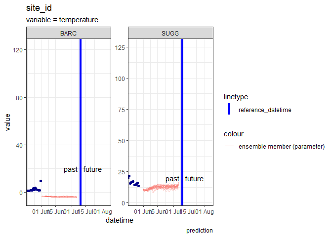
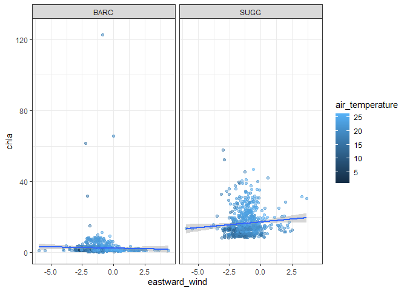

-   <a href="#this-r-markdown-document" id="toc-this-r-markdown-document">1
    This R markdown document</a>
-   <a href="#introduction-to-neon-forecast-challenge"
    id="toc-introduction-to-neon-forecast-challenge">2 Introduction to NEON
    forecast challenge</a>
    -   <a href="#aquatics-challenge" id="toc-aquatics-challenge">2.1 Aquatics
        challenge</a>
    -   <a href="#submission-requirements" id="toc-submission-requirements">2.2
        Submission requirements</a>
-   <a href="#the-forecasting-workflow" id="toc-the-forecasting-workflow">3
    The forecasting workflow</a>
    -   <a href="#read-in-the-data" id="toc-read-in-the-data">3.1 Read in the
        data</a>
    -   <a href="#visualise-the-data" id="toc-visualise-the-data">3.2 Visualise
        the data</a>
-   <a href="#introducing-co-variates" id="toc-introducing-co-variates">4
    Introducing co-variates</a>
    -   <a href="#download-co-variates" id="toc-download-co-variates">4.1
        Download co-variates</a>
        -   <a href="#download-historic-data" id="toc-download-historic-data">4.1.1
            Download historic data</a>
        -   <a href="#download-future-weather-forecasts"
            id="toc-download-future-weather-forecasts">4.1.2 Download future weather
            forecasts</a>
-   <a href="#model-1-linear-model-with-covariates"
    id="toc-model-1-linear-model-with-covariates">5 Model 1: Linear model
    with covariates</a>
    -   <a href="#specify-forecast-model" id="toc-specify-forecast-model">5.1
        Specify forecast model</a>
    -   <a href="#convert-to-efi-standard-for-submission-to-the-challenge"
        id="toc-convert-to-efi-standard-for-submission-to-the-challenge">5.2
        Convert to EFI standard for submission to the Challenge</a>
    -   <a href="#optional-submit-forecast"
        id="toc-optional-submit-forecast">5.3 Optional: Submit forecast</a>
    -   <a href="#tasks" id="toc-tasks">5.4 TASKS</a>
    -   <a href="#register-your-participation"
        id="toc-register-your-participation">5.5 Register your participation</a>

# 1 This R markdown document

This document present workshop materials initially presented in the
Forecast Challenge part of the GLEON2022 workshop “Introduction to
real-time lake forecasting: learn, teach, and generate forecasts with
Macrosystems EDDIE modules and the NEON Forecasting Challenge.” The
materials have been modified slightly for use in additional workshops.

To complete the workshop via this markdown document the following
packages will need to be installed:

-   `remotes`
-   `fpp3`
-   `tsibble`
-   `tidyverse`
-   `lubridate`
-   `neon4cast` (from github)

The following code chunk should be run to install packages.

``` r
install.packages('remotes')
install.packages('fpp3') # package for applying simple forecasting methods
install.packages('tsibble') # package for dealing with time series data sets and tsibble objects
install.packages('tidyverse') # collection of R packages for data manipulation, analysis, and visualisation
install.packages('lubridate') # working with dates and times
remotes::install_github('eco4cast/neon4cast') # package from NEON4cast challenge organisers to assist with forecast building and submission
```

Additionally, R version 4.2 is required to run the neon4cast package.
It’s also worth checking your Rtools is up to date and compatible with R
4.2, see
(<https://cran.r-project.org/bin/windows/Rtools/rtools42/rtools.html>).

``` r
version$version.string
```

    ## [1] "R version 4.2.0 (2022-04-22 ucrt)"

``` r
library(tidyverse)
```

    ## Warning: package 'tidyverse' was built under R version 4.2.3

    ## Warning: package 'ggplot2' was built under R version 4.2.3

    ## Warning: package 'tibble' was built under R version 4.2.1

    ## Warning: package 'tidyr' was built under R version 4.2.2

    ## Warning: package 'readr' was built under R version 4.2.1

    ## Warning: package 'purrr' was built under R version 4.2.2

    ## Warning: package 'dplyr' was built under R version 4.2.1

    ## Warning: package 'stringr' was built under R version 4.2.2

    ## Warning: package 'forcats' was built under R version 4.2.3

    ## ── Attaching core tidyverse packages ──────────────────────── tidyverse 2.0.0 ──
    ## ✔ dplyr     1.0.10     ✔ readr     2.1.3 
    ## ✔ forcats   1.0.0      ✔ stringr   1.5.0 
    ## ✔ ggplot2   3.4.2      ✔ tibble    3.1.8 
    ## ✔ lubridate 1.8.0      ✔ tidyr     1.3.0 
    ## ✔ purrr     1.0.1      
    ## ── Conflicts ────────────────────────────────────────── tidyverse_conflicts() ──
    ## ✖ dplyr::filter() masks stats::filter()
    ## ✖ dplyr::lag()    masks stats::lag()
    ## ℹ Use the ]8;;http://conflicted.r-lib.org/conflicted package]8;; to force all conflicts to become errors

``` r
library(lubridate)
```

If you do not wish to run the code yourself you can follow along via the
html (NEON_forecast_challenge_workshop.md), which can be downloaded from
the [Github
repository](https://github.com/OlssonF/NEON-forecast-challenge-workshop).

# 2 Introduction to NEON forecast challenge

The EFI RCN NEON Forecast Challenge asks the scientific community to
produce ecological forecasts of future conditions at NEON sites by
leveraging NEON’s open data products. The Challenge is split into five
themes that span aquatic and terrestrial systems, and population,
community, and ecosystem processes across a broad range of ecoregions.
We are excited to use this Challenge to learn more about the
predictability of ecological processes by forecasting NEON data before
it is collected.

Which modeling frameworks, mechanistic processes, and statistical
approaches best capture community, population, and ecosystem dynamics?
These questions are answerable by a community generating a diverse array
of forecasts. The Challenge is open to any individual or team from
anywhere around the world that wants to submit forecasts. Sign up
[here.](https://projects.ecoforecast.org/neon4cast-docs/Participation.html).

## 2.1 Aquatics challenge

What: Freshwater surface water temperature, oxygen, and chlorophyll-a.

Where: 7 lakes and 27 river/stream NEON sites.

When: Daily forecasts for at least 30-days in the future. New forecast
submissions, that use new data to update the forecast, are accepted
daily. The only requirement is that submissions are predictions of the
future at the time the forecast is submitted.

Today we will focus on lake sites only and will start with forecasting
water temperature. For the challenge, you can chose to submit to either
the lakes, rivers or streams or all three! You can also chose to submit
any of the three focal variables (temperature, oxygen, and chlorophyll).
Find more information about the aquatics challenge
[here](https://projects.ecoforecast.org/neon4cast-docs/Aquatics.html).

## 2.2 Submission requirements

For the Challange, forecasts must include quantified uncertainty. The
file can represent uncertainty using an ensemble forecast (multiple
realizations of future conditions) or a distribution forecast (with mean
and standard deviation), specified in the family and parameter columns
of the forecast file.

For an ensemble forecast, the `family` column uses the word `ensemble`
to designate that it is a ensemble forecast and the parameter column is
the ensemble member number (1, 2, 3 …). For a distribution forecast, the
`family` column uses the word `normal` to designate a normal
distribution and the parameter column must have the words mu and sigma
for each forecasted variable, site_id, and datetime. For forecasts that
don’t have a normal distribution we recommend using the ensemble format
and sampling from your non-normal distribution to generate a set of
ensemble members that represents your distribution. I will go through
examples of both `ensemble` and `normal` forecasts as examples.

The full list of required columns and format can be found in the
[Challenge
documentation](https://projects.ecoforecast.org/neon4cast-docs/Submission-Instructions.html).

# 3 The forecasting workflow

## 3.1 Read in the data

We start forecasting by first looking at the historic data - called the
‘targets’. These data are available near real-time, with the latency of
approximately 24-48 hrs. Here is how you read in the data from the
targets file available from the EFI server.

``` r
#read in the targets data
targets <- read_csv('targets-neon-chla.csv')
target_sites <- targets |> distinct(site_id) |> pull()
```

Information on the NEON sites can be found in the
`NEON_Field_Site_Metadata_20220412.csv` file on GitHub. It can be
filtered to only include aquatic sites. This table has information about
the field sites, including location, ecoregion, information about the
watershed (e.g. elevation, mean annual precipitation and temperature),
and lake depth.

``` r
# read in the sites data
aquatic_sites <- read_csv("https://raw.githubusercontent.com/eco4cast/neon4cast-targets/main/NEON_Field_Site_Metadata_20220412.csv") |>
  dplyr::filter(field_site_id %in% target_sites)
```

Let’s take a look at the targets data!

    ## Rows: 3,866
    ## Columns: 4
    ## $ datetime    <date> 2017-08-27, 2017-08-28, 2017-08-29, 2017-08-30, 2017-08-3…
    ## $ site_id     <chr> "BARC", "BARC", "BARC", "BARC", "BARC", "BARC", "BARC", "B…
    ## $ variable    <chr> "chla", "chla", "chla", "chla", "chla", "chla", "chla", "c…
    ## $ observation <dbl> NA, NA, NA, NA, NA, NA, NA, NA, NA, NA, NA, NA, NA, NA, NA…

The columns of the targets file show the time step (daily for aquatics
challenge), the 4 character site code (`site_id`), the variable being
measured, and the mean daily observation. Here we are looking only at
two lake sites (`BARC` and `SUGG`) chlorophyll (`chla`) observations.

## 3.2 Visualise the data


Chlorophyll concentration is a proxy used in water quality monitoring
for algal biomass. Large chlorophyll values are indication of algal
blooms and important water quality parameter. Chlorophyll concentration
in natural waters is driven by a complex interaction of temperatures,
nutrients, hydroynamic conditions that is not well quantified and can be
quite stochastic in nature.

# 4 Introducing co-variates

One important step to overcome when thinking about generating forecasts
is to include co-variates in the model. A chlorophyll forecast, for
example, may be benefit from information about past and future weather.
The neon4cast challenge package includes functions for downloading past
and future NOAA weather forecasts for all of the NEON sites. The 3 types
of data are as follows:

-   stage_1: raw forecasts - 31 member ensemble forecasts at 3 hr
    intervals for the first 10 days, and 6 hr intervals for up to 35
    days at the NEON sites.
-   stage_2: a processed version of Stage 1 in which fluxes are
    standardized to per second rates, fluxes and states are interpolated
    to 1 hour intervals and variables are renamed to match conventions.
    We recommend this for obtaining future weather by using
    `neon4cast::noaa_stage2()`. Future weather forecasts include a
    30-member ensemble of equally likely future weather conditions.
-   stage_3: can be viewed as the “historical” weather and is
    combination of day 1 weather forecasts (i.e., when the forecasts are
    most accurate). You can download this “stacked” NOAA product using
    `neon4cast::noaa_stage3()`.

These functions create a connection to the dataset hosted on the
eco4cast server. To download the data you have to tell the function to
`collect()` it. These data set can be subsetted and filtered using
`dplyr` functions prior to download to limit the memory usage.

You can read more about the NOAA forecasts available for the NEON sites
[here:](https://projects.ecoforecast.org/neon4cast-docs/Shared-Forecast-Drivers.html)

## 4.1 Download co-variates

### 4.1.1 Download historic data

We will generate a chlorophyll using `air_temperature` and
`eastward_wind` as a co-variate. Note: This code chunk can take a few
minutes to execute as it accesses the NOAA data depending on your
internet connection.

``` r
# past stacked weather
df_past <- neon4cast::noaa_stage3()

variables <- c("air_temperature", "eastward_wind")
#Other variable names can be found at https://projects.ecoforecast.org/neon4cast-docs/Shared-Forecast-Drivers.html#stage-3

noaa_past <- df_past |> 
  dplyr::filter(site_id %in% target_sites,
                datetime >= ymd('2017-01-01'),
                variable %in% variables) |> 
  dplyr::collect()

noaa_past[1:10,]
```

    ## # A tibble: 10 × 9
    ##    datetime            site_id longitude latitude family   parameter variable   
    ##    <dttm>              <chr>       <dbl>    <dbl> <chr>        <int> <chr>      
    ##  1 2020-09-25 00:00:00 BARC        -82.0     29.7 ensemble         1 air_temper…
    ##  2 2020-09-25 00:00:00 BARC        -82.0     29.7 ensemble         2 air_temper…
    ##  3 2020-09-25 00:00:00 BARC        -82.0     29.7 ensemble         3 air_temper…
    ##  4 2020-09-25 00:00:00 BARC        -82.0     29.7 ensemble         4 air_temper…
    ##  5 2020-09-25 00:00:00 BARC        -82.0     29.7 ensemble         5 air_temper…
    ##  6 2020-09-25 00:00:00 BARC        -82.0     29.7 ensemble         6 air_temper…
    ##  7 2020-09-25 00:00:00 BARC        -82.0     29.7 ensemble         7 air_temper…
    ##  8 2020-09-25 00:00:00 BARC        -82.0     29.7 ensemble         8 air_temper…
    ##  9 2020-09-25 00:00:00 BARC        -82.0     29.7 ensemble         9 air_temper…
    ## 10 2020-09-25 00:00:00 BARC        -82.0     29.7 ensemble        10 air_temper…
    ## # ℹ 2 more variables: height <chr>, prediction <dbl>

This is a stacked ensemble forecast of the one day ahead forecasts. To
get an estimate of the historic conditions we can take a mean of these
ensembles. We will also need to convert the temperatures to Celsius from
Kelvin.

``` r
# aggregate the past to mean values
noaa_past_mean <- noaa_past |> 
  mutate(datetime = as_date(datetime)) |> 
  group_by(datetime, site_id, variable) |> 
  summarize(prediction = mean(prediction, na.rm = TRUE), .groups = "drop") |> 
  pivot_wider(names_from = variable, values_from = prediction) |> 
  # convert air temp to C
  mutate(air_temperature = air_temperature - 273.15)
```

We can then look at the future weather forecasts in the same way but
using the `noaa_stage2()`. The forecast becomes available from NOAA at
5am UTC the following day, so we take the air temperature forecast from
yesterday (`noaa_date`) to make the water quality forecasts. Then we can
use the ensembles to produce uncertainty in the chlorophyll forecast by
forecasting multiple (31) future water temperatures.

### 4.1.2 Download future weather forecasts

``` r
# Note: New forecast only available at 5am UTC the next day - so if forecasting in realtime look for yesterday's forecast

# generate forecast(s) for June 2023
forecast_date <- as_date('2023-06-01')

df_future <- neon4cast::noaa_stage2()

variables <- c("air_temperature", "eastward_wind")

noaa_future <- df_future |> 
  dplyr::filter(reference_datetime == forecast_date,
                datetime >= forecast_date,
                site_id %in% target_sites,
                variable %in% variables) |> 
  dplyr::collect()
```

The forecasts are hourly and we are interested in using daily mean air
temperature for water temperature forecast generation.

``` r
noaa_future_daily <- noaa_future |> 
  mutate(datetime = as_date(datetime)) |> 
  # mean daily forecasts at each site per ensemble
  group_by(datetime, site_id, parameter, variable) |> 
  summarize(prediction = mean(prediction)) |>
  pivot_wider(names_from = variable, values_from = prediction) |>
  # convert to Celsius
  mutate(air_temperature = air_temperature - 273.15) |> 
  select(datetime, site_id, air_temperature, parameter, eastward_wind)
```

    ## `summarise()` has grouped output by 'datetime', 'site_id', 'parameter'. You can
    ## override using the `.groups` argument.

``` r
noaa_future_daily[1:10,]
```

    ## # A tibble: 10 × 5
    ## # Groups:   datetime, site_id, parameter [10]
    ##    datetime   site_id air_temperature parameter eastward_wind
    ##    <date>     <chr>             <dbl>     <int>         <dbl>
    ##  1 2023-06-01 BARC               25.0         1         -3.63
    ##  2 2023-06-01 BARC               23.4         2         -3.10
    ##  3 2023-06-01 BARC               24.8         3         -3.38
    ##  4 2023-06-01 BARC               24.1         4         -3.44
    ##  5 2023-06-01 BARC               25.4         5         -4.05
    ##  6 2023-06-01 BARC               24.4         6         -2.74
    ##  7 2023-06-01 BARC               25.2         7         -3.19
    ##  8 2023-06-01 BARC               24.8         8         -3.02
    ##  9 2023-06-01 BARC               24.3         9         -3.54
    ## 10 2023-06-01 BARC               23.8        10         -2.93

Now we have a timeseries of historic data and a 30 member ensemble
forecast of future air temperatures.


# 5 Model 1: Linear model with covariates

We will fit a simple linear model between historic air temperature and
the chlorophyll targets data. Using this model we can then use our
future estimates of air temperature (all 30 ensembles) to estimate
chlorophyll at each site. The ensemble weather forecast will therefore
propagate uncertainty into the chlorophyll forecast and give an estimate
of driving data uncertainty.

We will start by joining the historic weather data with the targets to
aid in fitting the linear model.

``` r
targets_lm <- targets |> 
  pivot_wider(names_from = 'variable', values_from = 'observation') |> 
  left_join(noaa_past_mean, 
            by = c("datetime","site_id"))

targets_lm[1050:1060,]
```

    ## # A tibble: 11 × 5
    ##    datetime   site_id  chla air_temperature eastward_wind
    ##    <date>     <chr>   <dbl>           <dbl>         <dbl>
    ##  1 2020-12-26 BARC     1.91            11.8       -1.78  
    ##  2 2020-12-27 BARC     1.64            13.4       -1.80  
    ##  3 2020-12-28 BARC     1.46            16.5       -1.93  
    ##  4 2020-12-29 BARC     1.17            16.9       -1.89  
    ##  5 2020-12-30 BARC     1.23            18.3       -1.48  
    ##  6 2020-12-31 BARC     1.32            20.0       -0.167 
    ##  7 2021-01-01 BARC     1.58            20.8        0.144 
    ##  8 2021-01-02 BARC     1.40            20.4        0.0419
    ##  9 2021-01-03 BARC     1.80            19.6       -0.832 
    ## 10 2021-01-04 BARC     1.06            15.7       -2.03  
    ## 11 2021-01-05 BARC     1.40            15.8       -1.55

To fit the linear model we use the base R `lm()` but there are also
methods to fit linear (and non-linear) models in the `fable::` package.
You can explore the
[documentation](https://otexts.com/fpp3/regression.html) for more
information on the `fable::TSLM()` function. We can fit a separate
linear model for each site. For example, at Lake Suggs, this would look
like:

``` r
example_site <- 'SUGG'

site_target <- targets_lm |> 
  filter(site_id == example_site)

noaa_future_site <- noaa_future_daily |> 
  filter(site_id == example_site)

#Fit linear model based on past data: chla = m * air temperature + b
fit <- lm(site_target$chla ~ site_target$air_temperature + site_target$eastward_wind)
    
# use linear regression to forecast water temperature for each ensemble member
forecasted_temperature <- fit$coefficients[1] + 
  fit$coefficients[2] * noaa_future_site$air_temperature +
  fit$coefficients[3] * noaa_future_site$eastward_wind
```

We can loop through this for each site to create a site-wise forecast of
water temperature based on a linear model and each forecasted air
temperature. We can run this forecast for each site and then bind them
together to submit as one forecast.

## 5.1 Specify forecast model

``` r
temp_lm_forecast <- NULL

for(i in 1:length(target_sites)) {  
  
  site <- target_sites[i]
  
  site_target <- targets_lm |>
    filter(site_id == site)

  noaa_future_site <- noaa_future_daily |> 
    filter(site_id == site)
  
  #Fit linear model based on past data: water temperature = m * air temperature + b
  fit <- lm(site_target$chla ~ site_target$air_temperature + site_target$eastward_wind)
  # fit <- lm(site_target$temperature ~ ....)
    
  # use linear regression to forecast water temperature for each ensemble member
  forecasted_temperature <- 
    fit$coefficients[1] +
    (fit$coefficients[2] * noaa_future_site$air_temperature) + 
    (fit$coefficients[3] * noaa_future_site$air_temperature) 
    
  # put all the relavent information into a tibble that we can bind together
  chla <- tibble(datetime = noaa_future_site$datetime,
                        site_id = site,
                        parameter = noaa_future_site$parameter,
                        prediction = forecasted_temperature,
                        variable = "chla")
  
  temp_lm_forecast <- dplyr::bind_rows(temp_lm_forecast, chla)
  message(site, ' temperature forecast run')
  
}
```

    ## BARC temperature forecast run

    ## SUGG temperature forecast run

We now have 30 possible forecasts of water temperature at each site and
each day. On this plot each line represents one of the possible
forecasts and the range of forecasted water temperature is a simple
quantification of the uncertainty in our forecast.

Looking back at the forecasts we produced:



## 5.2 Convert to EFI standard for submission to the Challenge

Forecast standards are useful for maintaining consistent formats across
forecast generations. For the NEON forecast Challenge (including the
aquatics theme) the following standards are specified for a forecast.
For an ensemble forecast the documentation specifies the following
columns:

-   `datetime`: forecast timestamp for each time step
-   `reference_datetime`: The start of the forecast; this should be 0
    times steps in the future. This should only be one value of
    reference_datetime in the file
-   `site_id`: NEON code for site
-   `family`: name of probability distribution that is described by the
    parameter values in the parameter column; only `normal` or
    `ensemble` are currently allowed.
-   `parameter`: integer value for forecast replicate (from the `.rep`
    in fable output);
-   `variable`: standardized variable name from the theme
-   `prediction`: forecasted value (from the `.sim` column in fable
    output)
-   `model_id`: model name (no spaces)

We need to make sure the dataframe is in the correct format and then we
can submit this to the challenge as well! This is an ensemble forecast
(specified in the `family` column).

``` r
# Remember to change the model_id when you make changes to the model structure!
my_model_id <- 'your_model_id'

temp_lm_forecast_EFI <- temp_lm_forecast %>%
  mutate(model_id = my_model_id,
         reference_datetime = as_date(min(datetime)) - days(1),
         family = 'ensemble',
         parameter = as.character(parameter)) %>%
  select(model_id, datetime, reference_datetime, site_id, family, parameter, variable, prediction)
```

## 5.3 Optional: Submit forecast

Files need to be in the correct format for submission. The forecast
organizers have created tools to help aid in the submission process.
These tools can be downloaded from Github using
`remotes::install_github(eco4cast/neon4cast)`. These include functions
for submitting, scoring and reading forecasts:

-   `submit()` - submit the forecast file to the neon4cast server where
    it will be scored
-   `forecast_output_validator()` - will check the file is in the
    correct format to be submitted
-   `check_submission()` - check that your submission has been uploaded
    to the server

The file name needs to be in the format
theme-reference_datetime-model_id

``` r
# Start by writing the forecast to file
theme <- 'aquatics'
date <- temp_lm_forecast_EFI$reference_datetime[1]
forecast_name_1 <- paste0(temp_lm_forecast_EFI$model_id[1], ".csv")
forecast_file_1 <- paste(theme, date, forecast_name_1, sep = '-')
forecast_file_1
```

    ## [1] "aquatics-2023-05-31-your_model_id.csv"

``` r
write_csv(temp_lm_forecast_EFI, forecast_file_1)

neon4cast::forecast_output_validator(forecast_file_1)
```

    ## aquatics-2023-05-31-your_model_id.csv

    ## ✔ file name is correct
    ## ✔ forecasted variables found correct variable + prediction column
    ## ✔ file has ensemble distribution in family column
    ## ✔ file has parameter and family column with ensemble generated distribution
    ## ✔ file has site_id column
    ## ✔ file has time column
    ## ✔ file has correct time column
    ## ✔ file has reference_datetime column
    ## Forecast format is valid

    ## [1] TRUE

``` r
# can uses the neon4cast::forecast_output_validator() to check the forecast is in the right format
neon4cast::submit(forecast_file = forecast_file_1,
                  ask = FALSE) # if ask = T (default), it will produce a pop-up box asking if you want to submit
```

Is the linear model a reasonable relationship between air temperature
and water temperature? Would some non-linear relationship be better?
What about using yesterday’s air and water temperatures to predict
tomorrow? Or including additional parameters? There’s a lot of
variability in water temperatures unexplained by air temperature alone.

    ## `geom_smooth()` using formula = 'y ~ x'



## 5.4 TASKS

Possible modifications to Model 1 - simple linear model:

-   Include additional NOAA co-variates in the linear model (remember to
    ‘collect’ and subset the right data from NOAA)
-   Specify a non-linear relationship
-   Try forecasting another variable (oxygen or chlorophyll) - could you
    use your water temperature to estimate dissolved oxygen
    concentration at the surface?
-   Include a lag in the predictors

Remember to change the `model_id` so we can differentiate different
forecasts!

## 5.5 Register your participation

It’s really important that once you start submitting forecasts to the
Challenge that you register your participation. We ask that you complete
this [form](https://nd.qualtrics.com/jfe/form/SV_9MJ29y2xNrBOjqZ) which
asks you some simple questions about your forecast and team. This is
crucial for a couple of reasons:

1.  We can keep track different forecast submissions during the scoring
    process to see which forecast is performing the best. Your
    `model_id` will be used to track the submissions so any new forecast
    model requires a new `model_id`.
2.  The form gives consent for submissions to be included in
    Challenge-wide syntheses being carried out by the Challenge
    organisers. Partipants in the Challenge will be invited to join the
    synthesis projects on an opt-in basis.

Questions about Challenge registration and synthesis participation can
be directed to [Freya Olsson](mailto:freyao@vt.edu).
